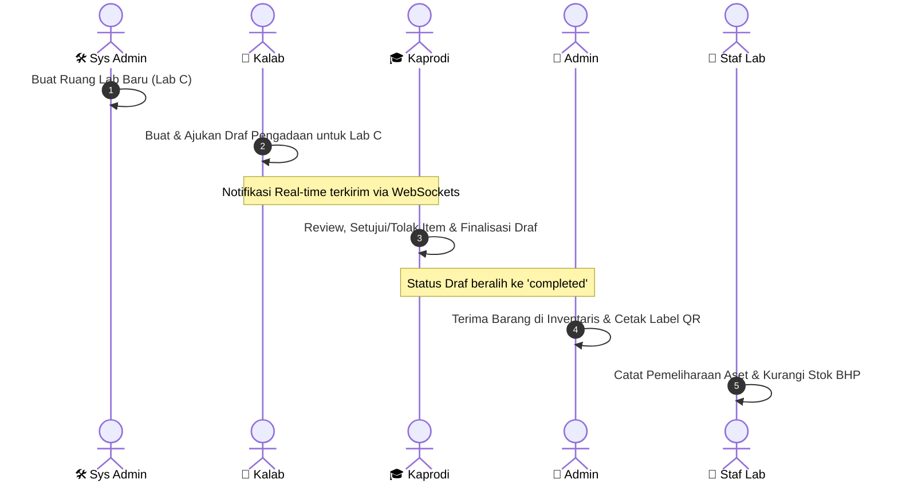

# 🔐 Daftar Akun Demo & Skenario Pengujian LokaLab Suite

Dokumen ini memuat daftar akun uji coba (_demo accounts_) yang terdaftar secara _default_ dalam basis data MySQL (`lokalab_db`) melalui seeder. Akun-akun ini dikonfigurasi untuk memudahkan pengujian hak akses berbasis peran (_Role-Based Access Control_ / RBAC) dan verifikasi alur kerja operasional secara menyeluruh (_end-to-end_).

> [!IMPORTANT]
> **Kredensial Global Uji Coba:**
>
> - **Kata Sandi Default (Semua Akun):** `password123`
> - **Metode Pengamanan Sesi:** Disimpan secara asinkron dalam HttpOnly Cookie (tidak terekspos ke JavaScript).

---

## 👥 Matriks Akun Berdasarkan Peran

Tabel di bawah ini merinci akun demo yang tersedia untuk pengujian fungsionalitas sistem:

| No  | Peran (Role)               | Nama Pengguna         | Surel (Email)        | Inisial | Status Akun | Batasan Akses & Hak Istimewa                                                                                   |
| :-- | :------------------------- | :-------------------- | :------------------- | :------ | :---------- | :------------------------------------------------------------------------------------------------------------- |
| 1   | **🛠️ Sys Admin**           | Anindita Hartono      | `anindita@kampus.id` | `AH`    | `aktif`     | Kontrol penuh sistem: Manajemen pengguna (CRUD), Manajemen ruangan (CRUD), dan verifikasi _Audit Logs_ global. |
| 2   | **🧪 Kalab**               | Dr. Pradipta Wirasena | `pradipta@kampus.id` | `PW`    | `aktif`     | Pengelolaan perencanaan pengadaan tahunan untuk aset fisik dan Bahan Habis Pakai (BHP).                        |
| 3   | **🧪 Kalab (Alt)**         | Dr. Sari Wulandari    | `sari@kampus.id`     | `SW`    | `aktif`     | Akun sekunder untuk pengujian kolaborasi draf antarkepala laboratorium.                                        |
| 4   | **🎓 Kaprodi**             | Prof. Hendra Saputra  | `hendra@kampus.id`   | `HS`    | `aktif`     | Kewenangan penuh persetujuan anggaran, peninjauan item draf, dan finalisasi draf (_freeze state_).             |
| 5   | **💼 Admin**               | Faqih Ramadhan        | `faqih@kampus.id`    | `FR`    | `aktif`     | Logistik penerimaan barang dari draf final, asetisasi (cetak label QR), dan ekspor dokumen BAST PDF.           |
| 6   | **💼 Admin (Alt)**         | Tirta Halim           | `tirta@kampus.id`    | `TH`    | `aktif`     | Akun sekunder staf administrasi logistik.                                                                      |
| 7   | **🔧 Staf Lab**            | Maharani Larasati     | `maharani@kampus.id` | `ML`    | `aktif`     | Pencatatan log pemeliharaan aset, penggunaan stok BHP, serta proses restock BHP.                               |
| 8   | **🔧 Staf Lab (Alt)**      | Daud Saputra          | `daud@kampus.id`     | `DS`    | `aktif`     | Akun sekunder staf laboratorium operasional.                                                                   |
| 9   | **🔧 Staf Lab (Nonaktif)** | Eggy Pratama          | `eggy@kampus.id`     | `EP`    | `paused`    | Akun yang ditangguhkan. Digunakan khusus untuk menguji kegagalan login akibat pemblokiran administratif.       |

---

## ⚡ Alur Skenario Pengujian Terintegrasi (End-to-End)

Untuk memverifikasi integrasi basis data rill, integritas transaksi, dan sinkronisasi _real-time_ berbasis WebSocket, kami merekomendasikan skenario pengujian berurutan berikut:

### Panduan Detail Langkah Pengujian:

1. **Fase 1: Konfigurasi Infrastruktur Awal**
   - Masuk sebagai **Sys Admin** (`anindita@kampus.id`).
   - Buka menu manajemen ruangan, tambahkan satu ruangan baru (contoh: _Lab Komputasi Awan_).
2. **Fase 2: Perencanaan Pengadaan Aset**
   - Masuk sebagai **Kalab** (`pradipta@kampus.id`).
   - Buat Draf Pengadaan Baru untuk ruangan yang baru saja ditambahkan oleh Sys Admin.
   - Masukkan beberapa barang inventaris (misal: _Server Rack_) dan Bahan Habis Pakai (misal: _Kabel RJ45_), lalu klik **Submit Draf**.
3. **Fase 3: Pengendalian & Evaluasi Anggaran**
   - Masuk sebagai **Kaprodi** (`hendra@kampus.id`).
   - Buka menu _Review Pengadaan_, tinjau item yang diajukan oleh Kalab. Anda dapat menyetujui atau menolak item secara spesifik.
   - Setelah selesai, klik **Finalisasi Draf** untuk membekukan data pengadaan (_freeze_).
4. **Fase 4: Penerimaan Logistik & Asetisasi**
   - Masuk sebagai **Admin** (`faqih@kampus.id`).
   - Buka menu _Penerimaan Barang_. Terima item-item yang telah disetujui oleh Kaprodi. Pada formulir penerimaan, Anda dapat memilih kondisi barang (Baik, Perlu cek, Rusak) sehingga unit cacad dapat ditandai dengan tepat.
   - Pindai / Unggah foto QR Universitas yang ada pada aset fisik. Sistem akan mendekode QR kampus tersebut secara otomatis menggunakan pustaka `jsQR` dan menghasilkan barcode/label QR sistem yang disesuaikan secara dinamis. Klik **Cetak BAST (PDF)** untuk mengunduh dokumen serah terima resmi.
5. **Fase 5: Operasional & Pemeliharaan**
   - Masuk sebagai **Staf Lab** (`maharani@kampus.id`) atau **Admin** (`faqih@kampus.id`).
   - Buka menu _BHP_. Gunakan filter ruangan (Room Filter) di bagian atas untuk menyaring daftar BHP yang dialokasikan ke ruangan tertentu.
   - Untuk **Staf Lab** atau **Admin**, jika stok BHP menipis, Anda dapat menekan tombol **Ajukan Restock** untuk mengirim draf pengadaan BHP baru ke Kaprodi.
   - Catatan: Peran **Admin** (Staff Admin) diblokir dari memodifikasi langsung stok BHP di database (hanya boleh melalui pengajuan restock), sedangkan **Staf Lab** tetap dapat mencatat penggunaan/pengurangan operasional BHP.
   - Buka menu _Pemeliharaan_ untuk mencatat aktivitas pemeliharaan fisik. Sistem mendukung pemilihan beberapa aset sekaligus (multi-aset) melalui daftar centang (checkbox).
6. **Fase 6: Evaluasi Dashboard**
   - Buka dasbor utama untuk melihat visualisasi bagan kondisi aset (_Donut Chart_) dan _Audit Trail_ global yang ter-update secara otomatis tanpa perlu memuat ulang halaman.
