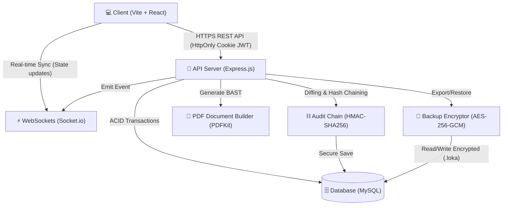

# 🧪 LokaLab Suite — Enterprise SaaS Inventory & Procurement System

[](CHANGELOG.md)
[](LICENSE)
[](SECURITY.md)
[](GUIDE.md)

LokaLab Suite adalah aplikasi sistem manajemen inventaris dan pengadaan (_procurement_) laboratorium tingkat enterprise berbasis SaaS. Sistem ini dirancang untuk menangani beban kerja operasional tinggi secara aman, berintegritas, dan _real-time_ di lingkungan perguruan tinggi maupun korporasi berskala besar dengan tata kelola aset yang ketat.

---

## 🏛️ Arsitektur Sistem

LokaLab dibangun dengan arsitektur decoupled (Vite + React di frontend, Node.js + Express.js di backend) dan diintegrasikan dengan protokol pengamanan berlapis:



---

## 👥 Matriks Akses Peran (Role-Based Access Control)

LokaLab membagi tanggung jawab kerja secara ketat menggunakan model RBAC (_Role-Based Access Control_) guna memastikan pemisahan tugas (_Segregation of Duties_) terlaksana dengan baik:

| Peran (Role)                | Tanggung Jawab Utama                              | Akses Fitur Utama                                                                |
| :-------------------------- | :------------------------------------------------ | :------------------------------------------------------------------------------- |
| **🛠️ System Administrator** | Pengelolaan pengguna dan audit keamanan global.   | CRUD Pengguna, CRUD Ruangan, Verifikasi Integritas Kriptografis Audit Logs.      |
| **🧪 Kepala Laboratorium**  | Perencanaan draf pengadaan tahunan.               | Inisiasi Draf Pengadaan (Aset & BHP), Pengajuan Draf ke Program Studi.           |
| **🎓 Ketua Program Studi**  | Pengendalian anggaran dan persetujuan pengadaan.  | Review Item Draf, Menyetujui/Menolak Pengajuan, Finalisasi Draf (Freeze State).  |
| **💼 Staf Administrasi**    | Logistik penerimaan barang dan asetisasi.         | Penerimaan Barang Terfinalisasi, Cetak Label QR Aset, Unduh PDF BAST Resmi.      |
| **🔧 Staf Laboratorium**    | Operasional harian laboratorium dan pemeliharaan. | Pencatatan Pemeliharaan Aset, Pengelolaan & Pencatatan Penggunaan BHP (Restock). |

---

## 🔒 Kemampuan Kunci Kelas Enterprise

1. **Sinkronisasi Real-time (WebSockets)**
   Memanfaatkan teknologi Socket.io untuk mengirimkan notifikasi instan dan memperbarui kondisi dasbor secara _real-time_ tanpa perlu memuat ulang halaman browser saat status pengadaan berubah.
2. **Dokumen Resmi Berita Acara Serah Terima (BAST)**
   Mesin pembuat dokumen PDF berbasis server menggunakan PDFKit yang menghasilkan Berita Acara Serah Terima (BAST) resmi dengan standar tata kelola universitas/organisasi secara dinamis.
3. **Penyimpanan Password Adaptif (bcrypt)**
   Mengamankan password menggunakan fungsi hash adaptif **bcrypt** dengan konfigurasi _12 salt rounds_, memastikan ketahanan mutlak terhadap serangan brute-force.
4. **Keamanan Sesi HttpOnly Cookie**
   Mengamankan token JWT dengan menyimpannya secara eksklusif dalam cookie bertipe `HttpOnly`, `Secure`, dan `SameSite=Lax` untuk mengeliminasi risiko pencurian token melalui serangan Cross-Site Scripting (XSS).
5. **Enkripsi File Cadangan (AES-256-GCM)**
   Mengekspor file cadangan `.loka` secara terenkripsi menggunakan algoritma standar militer **AES-256-GCM** dengan derivasi kunci dinamis (`scrypt`). Menjamin data aman dari kebocoran dan pendeteksian manipulasi file cadangan secara otomatis melalui _Authentication Tag_.
6. **Audit Trail Anti-Tamper (Hash Chaining)**
   Setiap log audit dihubungkan satu sama lain menggunakan tanda tangan kriptografi berbasis **HMAC-SHA256**. Administrator dapat melakukan verifikasi integritas rantai audit untuk mendeteksi manipulasi database terkecil sekalipun.
7. **Penanganan Error Terpusat (Centralized Error Handling)**
   Mengadopsi middleware penanganan kesalahan global yang menangkap semua kegagalan operasi secara terpusat, meminimalkan kode boilerplate try-catch pada kontroler, dan mengembalikan format respons JSON API kustom yang konsisten.
8. **Pemisahan Kode & Optimalisasi Memori (Code Splitting & Lazy Loading)**
   Menggunakan pemisahan bundel JavaScript dinamis (`React.lazy` dan `Suspense`) untuk memisahkan menu drawers dan modals ke dalam berkas-berkas terpisah. Ini memangkas ukuran awal bundel dari 3.3 MB hingga di bawah 500 KB, menghasilkan pemuatan halaman pertama yang instan.

---

## 🛠️ Stack Teknologi

Sistem dikonfigurasi menggunakan dependensi berkualitas tinggi dan teruji:

- **Frontend**: React 18, Vite, Tailwind CSS, Lucide Icons, Chart.js.
- **Backend**: Node.js, Express.js, Socket.io, Sequelize ORM (MySQL), bcrypt, jsonwebtoken.
- **Security & Utility**: Helmet, Zod Validation, PDFKit, Winston Logger.
- **Infrastruktur**: Docker & Docker Compose.

---

## 📁 Struktur Direktori Utama

```text
PWL_CapStone2/
├── .github/                   # Konfigurasi CI/CD & Template Isu/PR
├── assets/                    # Aset statis & berkas styling global
├── database/                  # Skema dan dokumentasi database MySQL
├── server/                    # Backend API (Express.js)
│   ├── config/                # Konfigurasi koneksi database & variabel
│   ├── controllers/           # Logika bisnis per fitur (RBAC, Audit, dll)
│   ├── middleware/            # Proteksi CORS, CSP, JWT, RBAC, Rate Limiter
│   ├── models/                # Skema ORM Sequelize (User, Room, Log, dll)
│   ├── routes/                # Endpoint router API
│   └── tests/                 # Pengujian unit keamanan & fungsional
├── src/                       # Frontend SPA (Vite + React)
│   ├── components/            # Komponen visual yang reusable
│   ├── data/                  # Konstanta data statis aplikasi
│   ├── screens/               # Halaman UI dashboard, login, & landing
│   └── services/              # Client API wrapper (Axios / fetch)
├── Dockerfile                 # Konfigurasi container backend/app
└── docker-compose.yml         # Orkestrasi multi-container (App + MySQL)
```

---

## 📖 Dokumentasi Proyek

Untuk mempermudah kontribusi dan deployment, proyek ini dilengkapi dengan panduan spesifik:

- 🚀 **[Panduan Setup & Pengujian](GUIDE.md)**: Panduan langkah-demi-langkah menjalankan aplikasi lewat Docker (Instan) atau Manual (Lokal).
- 🔐 **[Daftar Akun Demo](DAFTAR_AKUN.md)**: Informasi detail username, password, dan skenario pengujian role.
- 🔒 **[Spesifikasi Keamanan](SECURITY.md)**: Rincian mendalam mengenai implementasi kriptografi, HMAC, JWT, dan pertahanan siber aplikasi.
- 🤝 **[Pedoman Kontribusi](CONTRIBUTING.md)**: Standardisasi cara berkontribusi, penamaan branch, format commit, dan alur Pull Request.
- 📜 **[Catatan Rilis (Changelog)](CHANGELOG.md)**: Riwayat pembaruan, perbaikan bug, dan rilis versi sistem.
- 🛡️ **[Kode Etik (Code of Conduct)](CODE_OF_CONDUCT.md)**: Komitmen moral dalam lingkungan pengembangan kolaboratif.

---

## 📜 Lisensi

LokaLab Suite dirilis di bawah lisensi **MIT**. Anda bebas untuk menggunakan, menyalin, memodifikasi, dan mendistribusikannya secara gratis. Lihat berkas [LICENSE](LICENSE) untuk informasi selengkapnya.
